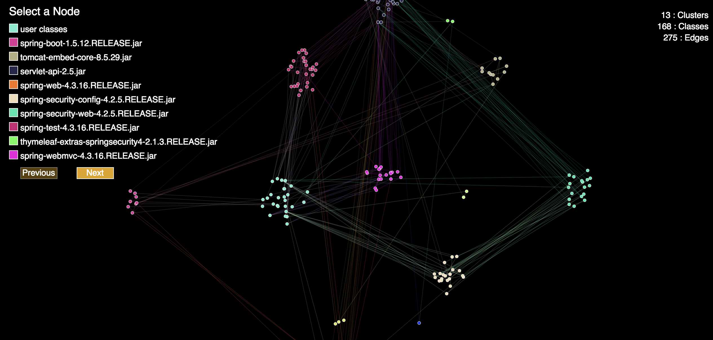

# third-party-lib-analyzer

A tool for analyzing third party libraries and how they connect to user classes. TPLA constructs a graph database of all dependencies, user classes, and relationships between all classes. It also allows some built in queries to be executed with reports generated based on the results.

### Graph Database Structure

The structure of the database is as follows.

Jar | Class | UserClass
------------- | ------------- | -------------
name | name | name
classes | classesDependedOn | classesDependedOn

#### Jar
* name - Name of jar saved as property.
* classes - Incoming relationship from classes the jar owns.

#### Class & UserClass
* name - Name of class saved as property.
* classesDependedOn - Outgoing relationship to other classes this class depends on

Class and UserClass are distinct node types to better facilitate queries where the desired starting point are user classes

### Built in Search Query
TPLA comes with some built in search functionaility. By providing a comma delimited list of jars, it will generate 3 types of reports. The purpose of these reports are to answer the question of, what user classes are affected by any particular jar, be it directly or transitively.

#### Basic StdOut report
The basic human readable report consists of a list of jars matched by the given search term, followed by various class dependency chains. To use WebGoat as an example, here is what a class chain looks like.

```
org.owasp.webwolf.FileServer
  |_org.springframework.web.multipart.MultipartFile
    |_org.springframework.core.io.InputStreamSource
```
    
Where the top most class is the user class, followed by a chain of classes that are depended on, until it reaches a class that belongs to the jar your search term matched. In this example the search term was spring-core.

#### JSON report
The JSON schema is as follows
```Javascript
{
  "DependencyRelationships": [
    {
      "jars": ["commons-io/commons-io/1.3.2/commons-io-1.3.2.jar"],
      "chains": [
        {
          "userClass": "org.owasp.webwolf.FileServer",
          "chain": [
            {
              "class": "org.owasp.webwolf.FileServer",
              "jars": ["user"]
            },
            {
              "class": "org.apache.commons.io.FileUtils",
              "jars": ["commons-io/commons-io/1.3.2/commons-io-1.3.2.jar"]
            }
          ],
        }
      ]
    }
  ]
}
```
* Where DependencyRelationships contains an array of all results. 
* In a given result set there is an array of jars for all the jars matched by a search term. 
* Then a chains array associated with the matched jars to show all the dependency chains that link from those jars to user classes and everything inbetween along the way.
* The chains array will contains the user class
* A chain array is paired with the user class which contains the entire chain leading that user class to the class that belongs to the matched jar

Important Note: Chains are filtered to just show a unique chain from a user class to a distinct jar. In other words in this case we see webwolf.FileServer depends on FileUtils and is reported. The user class FileServer may depend on other commons-io classes as well but only one will be reported. This is because we are primarily interested in knowing if a connection exists from a user class to a jar but not necessarily how many.

#### Visualization Reporter
TPLA contains a built in visualizer. It will emit a visualization folder containing some html files for visualizing the search queries executed. Simply open the index.html in your browser to use. 
* It will contain a list of your search terms. 
* The search terms are expandable showing two columns.
* Column 1 will contain the jars matched by the search term.
* Column 2 will contain all the user classes affected.
* Clicking a search term will open the visualization graph.


Top left is a list of jars present which are paginated. Top right lists stats. The view can be translated and zoomed. Indivdual nodes can be selected to highlight their connections. Selecting a node will highlight what jar it belongs to in the top left. Clicking on a colored square in the top left will translate view to that cluster of classes.

### Unused Jars Search
When using the -searchUnusedOnly argument, a query is run to determine what jars in the database are not referenced by a user class. The accuracy of the results will be based on the specified depth of the search. Like in the usage search, the higher the depth, the longer the query will take to complete. This search produces a text file in your output directory.

### Search for direct dependencies from User Class
When using the -userClassNames argument, the dependency search is inverted and instead you can search from a user class to dependencies. You can adjust the searchDepth like normal for how deep you want to search for transitive dependencies.

### Arguments
Arg | Description | Default | Required
------------- | ------------- | --- | ---
jarsDirectory | Directory containing all dependencies | N/A | yes
classesDirectory | Directory containing compiled classes | N/A | yes
dbDirectory | Directory where database will be written to | N/A | yes
jarNames | Comma delimited list of jars to search for | N/A | no
searchDepth | How deep a ralationship chain to search | 5 | no
outputDir | Directory to write reports to | output | no
searchOnly | Search existing DB without building/updating it | false | no
threads | Number of threads to use for building DB | 5 | no
singleThreadSearch | Use only 1 thread for searching | false | no
searchTimeout | Time out in minutes before canceling search and lowering depth | 60 | no
excludeTestDirs | Flag for excluding anything in a test directory when building DB | false | no
depExclusions | Comma delimited list of regex used for excluding dependencies when building DB | empty | no
searchUnusedOnly | Search for unused jars. Cannot be used in conjunction with searchOnly | false | no
searchJarExclusions | Comma delimited regex for excluding jars from used/unused jar searches. Filters after inclusions | empty | no
searchJarInclusions | Comma delimited regex for specifying which jars to include in used/unused searches. Filter before exclusions | empty | no
filterResults | Enable filtering on results so only one dependency chain from user class to jar is present per jar | false | no
userClassNames | Comma delimited list of user classes to search from | empty | no
exactMatch | Enables exact matching on jar names and user class names. Searches are contains by default | false | no

### Performance
Database construction is fairly performant. Searches on the other hand will vary wildly depending on the size and structure of your application. So be mindful of the search depth setting and start conservatively. Increasing the search depth increases search time and memory usage exponentially.

### Things to be Aware of
* The built in searches do some filtering and won't show all the connections that may exist from a user class to a jar.
* You can always connect to the DB directly using any standard way of interfacing with a neo4j DB
* TPLA does not handle what version of a jar a particular class uses. Rather a Class node will link to however many jars happen to own it. In the JSON reporting, it will provide all jars that own a particular class. 
* In regards to the built in visualizer. In projects where multiple versions of a jar exist or duplicate jars exist via fat jars, the visualizer only ever displays one jar. This could cause some confusion as the expected jar may not always be picked for displaying in the legend.
* The built in search is a CONTAINS type search. You can specify a whole jar name or just a name such as "spring". This means it is possible to just match on all jars by using ".jar" as a search term. This is HIGHLY DISCOURAGED. This search is highly inefficient and will blow up memory usage. It is encouraged to instead pass a list of all jars you want to search for, comma delimited.
